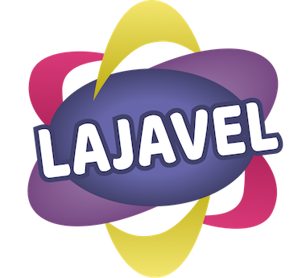
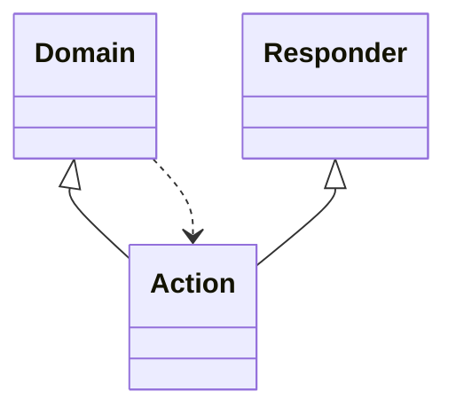

<div align="center">

# Lajavel: A Student MVC / ADR web framework



[![latest release badge]][latest release link] [![github stars badge]][github stars link] [![github forks badge]][github forks link]

[![latest commit to main badge]][latest commit to main link]

[![github open issues badge]][github open issues link] [![github open prs badge]][github open prs link]

[github forks badge]: https://flat.badgen.net/github/forks/DamienDabernat/Lajavel?icon=github
[github forks link]: https://useful-forks.github.io/?repo=DamienDabernat%2FLajavel
[github open issues badge]: https://flat.badgen.net/github/open-issues/DamienDabernat/Lajavel?icon=github
[github open issues link]: https://github.com/DamienDabernat/Lajavel/issues?q=is%3Aissue+is%3Aopen
[github open prs badge]: https://flat.badgen.net/github/open-prs/DamienDabernat/Lajavel?icon=github
[github open prs link]: https://github.com/DamienDabernat/Lajavel/pulls?q=is%3Apr+is%3Aopen
[github stars badge]: https://flat.badgen.net/github/stars/DamienDabernat/Lajavel?icon=github
[github stars link]: https://github.com/DamienDabernat/Lajavel/stargazers
[latest commit to main badge]: https://flat.badgen.net/github/last-commit/DamienDabernat/Lajavel/main?icon=github&color=yellow&label=last%20dev%20commit&cache=900
[latest commit to main link]: https://github.com/DamienDabernat/Lajavel/commits/main    
[latest release badge]: https://flat.badgen.net/github/release/DamienDabernat/Lajavel/development?icon=github
[latest release link]: https://github.com/DamienDabernat/Lajavel/releases

</div>

    
Lajavel is a project given to students to deepen their knowledge in object-oriented programming.
    
It is an attempt at a framework with the particularity of not following the conventional MVC architecture design pattern but rather the ADR pattern.

_Note: This project is a student project_

## Table of Contents

1. [Installation](#installation)
2. [Getting started](#getting-started)
3. [Features](#features)
4. [Graphic design](#graphic-design)
5. [Further Reading](#further-reading)

## Installation
    
Git clone this project.

## Getting started

To start the server simply write :

`Application.start(8080);`

Then you can register any route you want :

```java
public class MyApp {
    public static void main(String[] args) {
        Application.start(7070);
        // Register route through MVC pattern
        Route.register(HttpVerb.GET, "/", IndexController.class, "index");
        // Register route through ADR pattern
        Route.register(HttpVerb.GET, "/html/search", ShowBookAction.class, ShowBookHtmlResponder.class);
        Route.register(HttpVerb.GET, "/api/search", ShowBookAction.class, ShowBookApiResponder.class);

    }
}
```


### ADR pattern

#### Action

To create an action you must extend the Action class as follows :

```java
public class IndexAction extends Action {

    public IndexAction(Responder responder, Context context) {
        super(responder, context);
    }

    @Override
    public void execute(Context context) {
        //Here you can call all the entities you want
        //Then you must pass this objects to the responder, like this :
        //Book book = BookRepository.getOneBook();
        //this.responder.define(book);
        this.responder.respond();
    }
}
```

#### Responder

The response function is what the server will respond to. 
In this function you can change the response as much as you want. 
The `View.make()` function fetches the HTML file from the `resources/views` folder.

```java
public class IndexResponder extends Responder {

    public IndexResponder(Context context) {
        super(context);
    }

    @Override
    public void respond() {
        this.context.html(View.make("index"));
    }

}

```

### MVC pattern

Once you have registered your controller through the route you can create it as follows :

```java
public class IndexController extends Controller {
    public void index(Context context) {
        context.html(View.make("index"));
    }
}
```

The method name must be the same as the route you registered, and you must have a `context` parameter.

Don't forget to create the `index.html` file in the `resources/views` folder.

## Features

- HTML Template engine

## Graphic design

<div align="center">

List of colors used in this projects :


</div>

## Further Reading

Action–domain–responder (ADR) is a software architectural pattern that was proposed by Paul M. Jones as a refinement of Model–view–controller (MVC) that is better suited for web applications. He explain it as follows: 



_Action Domain Responder_ organizes a single user interface interaction between an HTTP client and a HTTP server-side application into three distinct roles.

_Action Domain Responder_ is an alternative to the "Model 2" misappropriation (for server-side over-the-network request/response interfaces) of the original _Model View Controller_ user interface pattern (for client-side in-memory graphical user interfaces). ADR is a user interface pattern specifically intended for server-side applications operating in an over-the-network, request/response environment.

Aligning expectations and factoring concerns away from the modern derivations of "Model 2" MVC toward _Action Domain Responder_ is not difficult. Here is one way of working through the change in approach.

#### Components

_Action_ is the logic to connect the _Domain_ and _Responder_. It invokes the _Domain_ with inputs collected from the HTTP Request, then invokes the _Responder_ with the data needed to build an HTTP Response.

_Domain_ is an entry point to the domain logic forming the core of the application. It may be a _Transaction Script_, _Service Layer_, _Application Service_, or something similar.

_Responder_ is the presentation logic to build an HTTP Response using data it receives from the _Action_. It deals with status codes, headers and cookies, content, formatting and transformation, templates and views, and so on.


You can find the rest of this explanation [`on the repository of Paul M. Jones`](https://github.com/pmjones/adr/blob/master/README.md).
